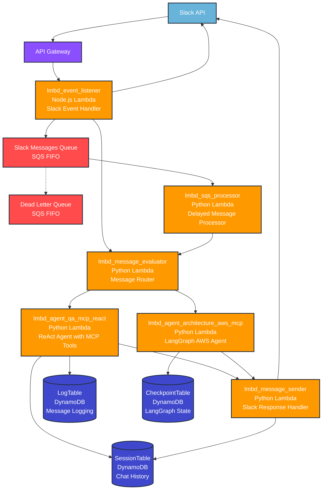
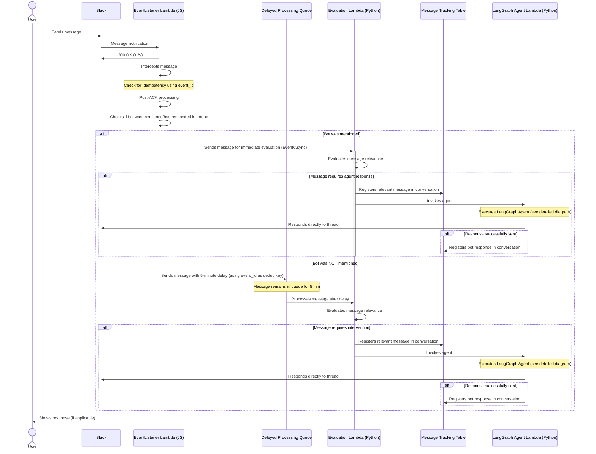
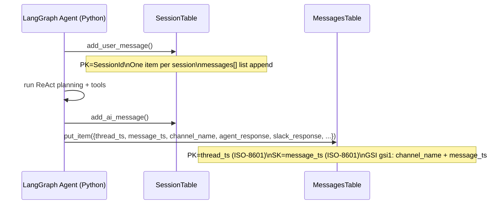

# Multi-Agent Architecture

## AWS Architecture Diagram (Current)

<!-- TODO: Create a Mermaid Diagram of the Current Architecture (lmbd_agent_architecture_aws_mcp, lmbd_agent_qa_mcp_react, lmbd_event_listener, lmbd_message_evaluator, lmbd_message_sender, lmbd_sqs_processor) -->

## Test Cases
- User writes a message in a thread and mentions the bot.
- User writes a message in a thread without mentioning the bot, but the bot has already responded in the thread ...
    - ... and the message is relevant to the conversation.
    - ... and the message is not relevant to the conversation.
- User writes a message in a thread without mentioning the bot, and the bot has not responded in the thread
    - ... and the message is relevant to the conversation. 
    - ... and the message is not relevant to the conversation.

## UML sequence diagram

### Main Flow Diagram

- Note over SQS: Visibility = 30 s, maxRetry = 3, DLQ enabled

### LangGraph Agent Execution Detail

```mermaid
sequenceDiagram
    rect rgb(50, 50, 50)
        participant LambdaPython as LangGraph Agent Lambda (Python)
        participant MCP as MCP Tools
        participant Tools as External Tools
        
        rect rgb(255, 255, 255)
            Note over LambdaPython,Tools: Task Execution Phase
            LambdaPython->>MCP: Initializes MCP clients
            activate MCP
            loop Tool Orchestration
                MCP->>Tools: Requests operations
                Tools-->>MCP: Returns results
                MCP-->>LambdaPython: Aggregates results
            end
            deactivate MCP
            
            LambdaPython->>LambdaPython: Formats response
        end
    end
```

## ReAct (Reasoning and Acting) Agent Paradigm

```mermaid
sequenceDiagram
    rect rgb(50, 50, 50)
        participant U as User
        participant A as LLM
        participant T as Tools
        U->>A: Initial input
        Note over A: Prompt + LLM
        loop while tool_calls present
            A->>T: Execute tools
            T-->>A: ToolMessage for each tool_calls
        end
        A->>U: Return final state
    end
```

## DynamoDB Persistence (MessagesTable and SessionTable)

MessagesTable (message logging)
- Keys
  - PK (thread_ts, String): Slack thread timestamp normalized to ISO-8601 via slack_ts_to_datetime(thread_ts)
  - SK (message_ts, String): Slack message timestamp normalized to ISO-8601 via slack_ts_to_datetime(message_ts, True)
  - GSI gsi1: channel_name (HASH) + message_ts (RANGE) to retrieve all messages in a channel ordered by time

SessionTable (chat history for reasoning)
- Key
  - PK (SessionId, String)
- SessionId format
  - Generated by memory.DynamoDBManager.session_table_part_key(channel_id, thread_ts) => "CH#{channel_id}#TH#{ISO8601(thread_ts)}"

### DynamoDB Interactions (Detail)

## Similar projects & References

- [LangChain AWS Template](https://github.com/langchain-ai/langchain-aws-template/tree/main/slack_bot)
